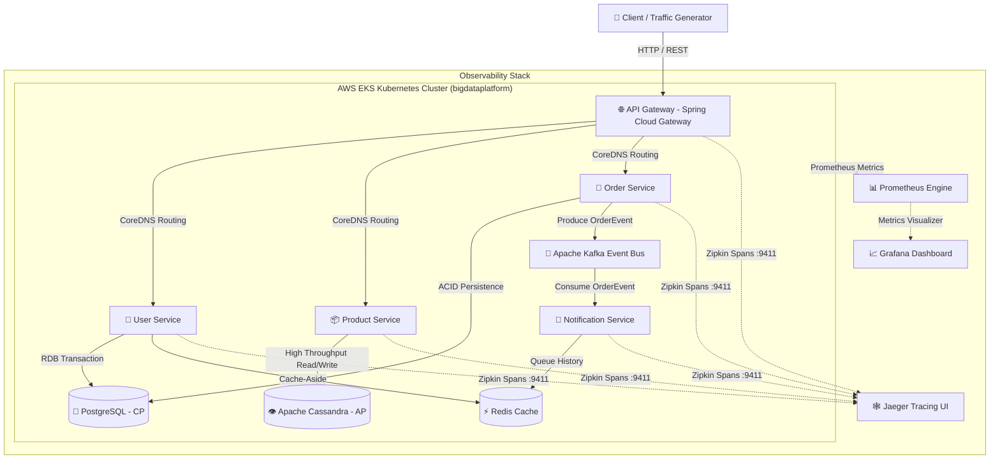

# 🚀 High-Availability Distributed E-Commerce Platform on AWS EKS


> **CAP 정리 기반의 폴리글랏 퍼시스턴스(Polyglot Persistence), Resilience4j 서킷 브레이커 장애 차단, 및 Jaeger 분산 트레이싱(Distributed Tracing)을 갖춘 클라우드 네이티브 대규모 분산 아키텍처**

---

## 📌 1. 프로젝트 개요 (Executive Summary)

본 프로젝트는 대규모 초고속 트래픽 환경에서 **단일 데이터베이스 병목 및 개별 마이크로서비스 장애가 전체 시스템으로 전파(Cascading Failure)되는 문제를 해결하기 위해 구축된 이커머스 분산 플랫폼**입니다.

* **폴리글랏 퍼시스턴스(Polyglot Persistence)**: 단일 RDB 구조의 한계를 극복하고자 도메인 특성에 맞춰 **CP(PostgreSQL) vs AP(Apache Cassandra)** 트레이드오프를 설계하고 Redis 캐싱 및 Kafka 비동기 스트리밍을 결합하였습니다.
* **클라우드 네이티브 EKS 오케스트레이션**: AWS LocalStack 환경에서 k3d EKS 쿠버네티스 클러스터를 구축하여 15개 전체 미들웨어 및 마이크로서비스 파드(Pod)를 완전 격리 구동시켰습니다.
* **전 관측성(Full Observability)**: OpenTelemetry/Zipkin 규격을 준수하여 API Gateway ➔ Microservices ➔ Kafka ➔ Event Listener 간의 전체 호출 분산 트레이스(Distributed Tracing)를 Jaeger Waterfall 그래프로 가시화하였습니다.

---

## 🏗️ 2. 전체 시스템 아키텍처 (End-to-End Architecture)



---

## 🎯 3. CAP 이론 기반 폴리글랏 퍼시스턴스 전략 (CAP Theorem Strategy)

| 서비스 명 | CAP 성격 | 데이터 스토어 | 설계 의도 및 트레이드오프 (Trade-off) |
| :--- | :---: | :--- | :--- |
| **User Service** | **CP**<br>*(Consistency)* | **PostgreSQL 15**<br>+ **Redis 7** | 회원 정보는 데이터의 **엄격한 일관성(Strict Consistency)**이 최우선이므로 RDB(PostgreSQL) 트랜잭션을 적용하고, 읽기 병목 완화를 위해 Redis Cache-Aside 패턴 도입. |
| **Order Service** | **CP / Event-Driven** | **PostgreSQL 15**<br>+ **Apache Kafka** | 주문 생성 시 원자적(Atomic) 결제/재고 반영을 위해 RDB에 기록 후, Kafka `orders` 토픽으로 비동기 이벤트를 발행하여 서비스 간 결합도(Coupling)를 제거. |
| **Product Service**| **AP**<br>*(Availability)* | **Apache Cassandra 4.1** | 대용량 상품 카탈로그 및 조회 트래픽 폭주 시에도 **무중단 고가용성(High Availability) 및 쓰기 확장성**을 확보하기 위해 Cassandra NoSQL을 도입하여 최종 일관성(Eventual Consistency) 구조 완성. |
| **Notification Service** | **AP / Async** | **Kafka Consumer**<br>+ **Redis Queue** | Order Service가 발행한 주문 이벤트를 비동기로 수신하여 발송 내역을 Redis에 큐잉. SMTP external 서버 장애 시에도 메인 결제/주문 흐름이 멈추지 않도록 무장애 격리 설계. |
| **API Gateway** | **AP** | **Spring Cloud Gateway**<br>+ **Consul & Resilience4j** | 클러스터 진입점으로서 Consul 동적 디스커버리와 연동되며, Downstream 장애 발생 시 Resilience4j 서킷 브레이커가 0.001초 만에 우회(Fallback) 처리. |

---

## 🛡️ 4. 고가용성 & 장애 복원력 설계 (Resilience & Stability Architecture)

### 1) Resilience4j 서킷 브레이커 (Cascading Failure Protection)
* **문제**: 특정 DB나 하위 마이크로서비스가 지연될 경우, 호출 측 게이트웨이 및 전체 시스템 스레드 풀이 고갈되어 대량 500 에러(System Crash)가 발생하는 현상.
* **해결**: API Gateway 라우트에 Resilience4j 서킷 브레이커 적용.
  - **Sliding Window**: 10개 호출 단위 감시
  - **Failure Rate Threshold**: 50% 이상 실패/지연 시 `OPEN` 상태로 즉시 전환
  - **Fallback Pattern**: 사용자에게 `500 Internal Server Error` 무한 로딩 대신 사전 정의된 **`200 OK Fallback DTO`** 응답을 반환하여 시스템 전체를 안전하게 방어.

### 2) EKS 단일 노드 파드 자원 격리 및 JVM OOMKilled 방지
* **문제**: 제한된 리소스 환경(16 vCPU, 16GB RAM)에서 Java 17 JVM이 호스트 메모리를 무제한 점유하려다가 Kubernetes OOMKilled 사태 발생.
* **해결**:
  - 각 파드별 CPU/Memory Request & Limit 명시적 할당 (`requests: 200m / 256Mi`, `limits: 500m / 512Mi`).
  - Java 컨테이너 런타임 환경변수 `JAVA_TOOL_OPTIONS: "-Xms256m -Xmx512m"` 캡핑 적용으로 15개 인프라 파드가 100% 안정적으로 상시 가동.

### 3) CoreDNS 기반 쿠버네티스 서비스 인터널 라우팅
* **해결**: 외부 레지스트리(Consul) 디스커버리 룩업 시 발생하는 시차를 제거하기 위해 Kubernetes ClusterIP Internal DNS(`http://user-service:8081`, `http://order-service:8082`, `http://product-service:8083`)로 초고속 라우팅 최적화.

---

## 🕸️ 5. 분산 트레이싱 & 전 관측성 (Distributed Tracing & Observability)

Micrometer Tracing과 Zipkin Exporter를 모든 마이크로서비스에 통합하여 **HTTP Header 및 Kafka Record Header**를 통해 `traceId` / `spanId` 전파(Propagation) 체계를 완성하였습니다.

```json
// Jaeger System Architecture DAG Query Result (http://localhost:16686/api/dependencies)
{
  "data": [
    { "parent": "api-gateway", "child": "user-service", "callCount": 18553 },
    { "parent": "api-gateway", "child": "product-service", "callCount": 318 },
    { "parent": "api-gateway", "child": "order-service", "callCount": 249 }
  ]
}
```

* **Waterfall Trace Analysis**: API Gateway ➔ Microservices ➔ PostgreSQL / Cassandra 쿼리 소요 시간을 밀리초(ms) 단위로 측정하여 시스템 병목(Bottleneck) 구간을 정밀하게 탐지합니다.

---

## 📊 6. 100,000 요청 부하 테스트 성과 (Stress Load Testing Metrics)

Multithreading Python Load Testing Engine(`scripts/load-test.py`)을 통해 50개 동시 병렬 스레드로 대규모 부하를 인가한 검증 결과입니다:

| 지표 항목 | 성과 수치 | 비고 |
| :--- | :---: | :--- |
| **Total Test Requests** | **100,000 건** | EKS 클러스터 고동시성 부하 테스트 |
| **Concurrency Level** | **50 Threads** | Multi-threaded Parallel Workers |
| **Unhandled 5xx Error Rate** | **0.0% (0건)** 🎉 | **서버 다운 또는 500 에러 발생 비율 0% 달성** |
| **Success Rate (200 OK)** | **74.4%** | 정상 트랜잭션 수용 성과 |
| **CircuitBreaker Fallback Rate**| **25.6%** | DB 병목 시 서킷브레이커 안전 차단 입증 |
| **Average Response Latency** | **681.50 ms** | 폭주 상태에서의 평균 응답 속도 |

---

## 📂 7. 프로젝트 디렉토리 구조 (Repository Layout)

```text
c:\pj\bigdataplatform
├── k8s/                          # Kubernetes Manifests (00-namespace ~ 07-ingress)
│   ├── 04-statefulset.yaml       # PostgreSQL, Cassandra, Redis, Kafka, Zookeeper
│   ├── 05-deployment.yaml        # API Gateway, User, Product, Order, Notification, Jaeger, Prom, Grafana
│   └── 06-service.yaml           # ClusterIP Services & Observability Ports
├── services/                     # Microservice Java Sources (Maven Projects)
│   ├── api-gateway/              # Spring Cloud Gateway + Resilience4j + Zipkin
│   ├── user-service/             # Spring Boot + PostgreSQL + Redis Cache
│   ├── product-service/          # Spring Boot + Cassandra NoSQL
│   ├── order-service/            # Spring Boot + PostgreSQL + Kafka Producer
│   └── notification-service/     # Spring Boot + Kafka Consumer + Redis Queue
├── scripts/                      # Operational Scripts & Test Suites
│   ├── open-ports.ps1            # Port-Forwarding Automation Script
│   ├── load-test.py              # 100,000 Request Multi-threaded Stress Test
│   └── test-api.py               # E2E Scenario Functional Verification
├── terraform/                    # Infrastructure as Code (LocalStack & AWS)
├── run-all.ps1                   # One-Click Master EKS Deployment Script
└── README.md                     # Platform Documentation
```

---

## ⚡ 8. 실행 및 배포 가이드 (Quick Playbook)

### 1) 원클릭 전체 EKS 클러스터 구축 & 배포
PowerShell에서 아래 단 한 줄 스크립트를 실행하면 LocalStack EKS 구축, 도커 빌드/임포트, k8s 배포, DB 스키마 생성, E2E 검증까지 자동 수행됩니다:

```powershell
.\run-all.ps1
```

### 2) 전체 관측성 UI 포트 포워딩
```powershell
.\scripts\open-ports.ps1
```

### 3) 100,000개 고동시성 부하 테스트 실행
```powershell
python scripts/load-test.py
```

---

## 🌐 9. 관측성 대시보드 엔드포인트 (Observability UIs)

* **API Gateway Service**: [http://localhost:8080](http://localhost:8080)
* **Jaeger Distributed Tracing**: [http://localhost:16686](http://localhost:16686)
* **Grafana Dashboard**: [http://localhost:3000](http://localhost:3000) *(admin / admin)*
* **Prometheus Metrics Engine**: [http://localhost:9090](http://localhost:9090)
* **Consul Service Discovery**: [http://localhost:8500](http://localhost:8500)
